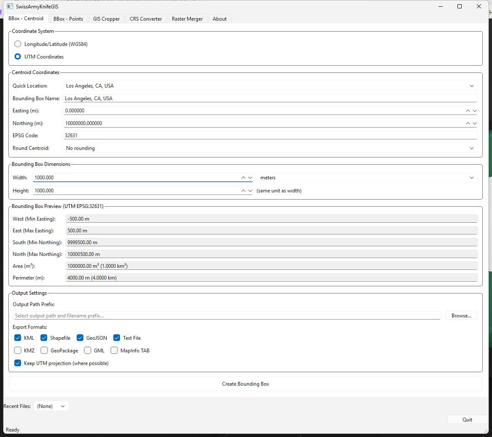

# SwissArmyKnifeGIS

_Because learning QGIS just to crop a raster is like buying a Ferrari to get groceries._




A lightweight, user-friendly GIS toolkit with a clean GUI for working with raster and vector geospatial data. Skip the complex menus and overwhelming buttons—just get your spatial analysis done without the corporate bloat.

## About This Project

Hi, I'm Adam Moses. I got tired of wrestling with expensive GIS software and complicated command-line tools just to do basic geospatial tasks. So I built SwissArmyKnifeGIS—a no-nonsense toolkit that handles the common stuff: cropping rasters, converting coordinates, merging imagery, and managing layers without making you take a semester-long course first.

The goal is simple: make GIS accessible. Whether you're a seasoned analyst or just need to reproject some shapefiles, this tool should get you there without the headache.

**Project Repository**: [https://github.com/AdamMoses-GitHub/SwissArmyKnifeGIS](https://github.com/AdamMoses-GitHub/SwissArmyKnifeGIS)

## What It Does

### The Main Features
- **Dual Bounding Box Tools**: Create bounding boxes from centroid+dimensions OR from four arbitrary corner points
- **Raster Tools**: Crop, merge, and analyze raster data (GeoTIFF, TIFF, etc.)
- **Vector Support**: Work with shapefiles, GeoJSON, and other vector formats
- **CRS Converter**: Transform coordinates between any projection—batch reproject multiple files at once
- **Interactive Map Canvas**: Pan, zoom, and actually see what you're working with
- **Export Flexibility**: Output to KML, Shapefile, GeoJSON, or multiple formats simultaneously

### The Nerdy Stuff
- Built on GDAL and GeoPandas so you know it's doing real geospatial work
- Batch processing for when you have 500 files that need the same treatment
- Multiple resampling methods (nearest, bilinear, cubic, etc.) for raster reprojection
- Spatial overlap analysis shows percentage of data within crop regions
- City selector with major world cities for quick bounding box creation
- Real-time preview updates as you configure tools

## Quick Start

Want all the details? Check out [INSTALL_AND_USAGE.md](INSTALL_AND_USAGE.md) for complete installation and usage instructions.

**TL;DR Version:**
```bash
git clone https://github.com/AdamMoses-GitHub/SwissArmyKnifeGIS.git
cd SwissArmyKnifeGIS
conda env create -f environment.yml
conda activate swissarmyknifegis
python -m swissarmyknifegis
```

**No conda?** Use pip:
```bash
pip install -e .
python -m swissarmyknifegis
```

## Tech Stack

| Component | Purpose | Why This One |
|-----------|---------|--------------|
| GDAL 3.6+ | Raster/Vector I/O | Industry standard, handles everything |
| GeoPandas 0.14+ | Vector analysis | Pandas for geography, basically |
| Rasterio 1.3.9+ | Raster data access | Simple, Pythonic, no drama |
| PySide6 6.6+ | GUI framework | Qt without the licensing headaches |
| Shapely 2.0+ | Geometric operations | Solid, reliable, does what it says |
| PyProj 3.6+ | CRS transformations | Handles every projection you throw at it |
| Rtree 1.1+ | Spatial indexing | Fast spatial queries without the wait |

## What Else?

- **License**: MIT (do whatever, just mention where it came from)
- **Contributing**: Suggestions and bug reports are welcome—submit an issue
- **Known Limitations**: Doesn't do routing, time series analysis, or make coffee
- **Requirements**: Python 3.10+, GDAL 3.6+, and a functioning spatialindex

## Documentation

- **[INSTALL_AND_USAGE.md](INSTALL_AND_USAGE.md)** - Full installation guide, features, development setup, and troubleshooting
- **[TODO.md](TODO.md)** - What's coming next and what's on the wishlist

---

<sub>Keywords: GIS, geospatial analysis, raster processing, vector data, GDAL, GeoPandas, coordinate systems, cartography, map visualization, raster merger, CRS conversion, shapefile, GeoTIFF, remote sensing, spatial analysis, Python GIS, open source, cross-platform, map canvas, layer management</sub>
